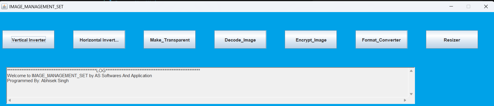

# Image Manager

## Overview

This project was completed in Class 9 to explore how digital images are stored, processed, and manipulated using Java.

The original source code has mostly been lost due to hard disk corruption, but I was able to recover and decompile the executable saved in cloud, which is preserved in this repository.

## Learning Outcomes

### Understanding Image Storage

* Learned how digital images are represented and stored in computer systems.
* Explored different image formats and their characteristics.

### Image Processing in Java

* Worked with Java libraries for reading and writing image files.
* Understood how pixel data can be accessed and modified programmatically.

### Image Conversions

* Implemented basic image format conversions.
* Learned how images can be transformed between different file types.

### Image Manipulation

* Performed basic image processing operations such as:

  * Resizing images
  * Cropping images
  * Adjusting image properties
  * Applying simple transformations

### Java Programming Concepts

* Improved understanding of file handling in Java.
* Practiced working with objects, methods, and graphical data.

## Screenshots

### Main Application Interface

## Conclusion

This project helped me understand the fundamentals of image storage, processing, and manipulation while strengthening my Java programming skills through practical implementation.
